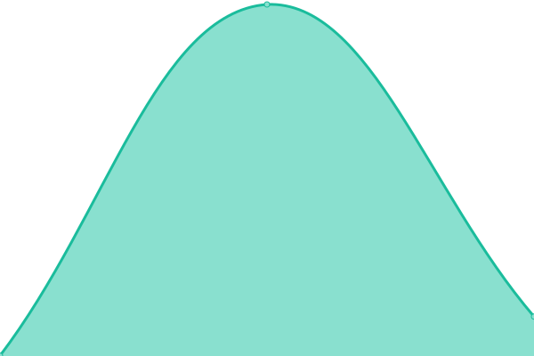

# [📈 Live Status](https://undp.github.io/uptime-monitor): <!--live status--> **🟩 All systems operational**

This repository contains the open-source uptime monitor and status page for [UNDP](https://www.undp.org), powered by [Upptime](https://github.com/upptime/upptime).

With [Upptime](https://upptime.js.org), you can get your own unlimited and free uptime monitor and status page, powered entirely by a GitHub repository. We use [Issues](https://github.com/undp/uptime-monitor/issues) as incident reports, [Actions](https://github.com/undp/uptime-monitor/actions) as uptime monitors, and [Pages](https://undp.github.io/uptime-monitor) for the status page.

<!--start: status pages-->
<!-- This summary is generated by Upptime (https://github.com/upptime/upptime) -->
<!-- Do not edit this manually, your changes will be overwritten -->
<!-- prettier-ignore -->
| URL | Status | History | Response Time | Uptime |
| --- | ------ | ------- | ------------- | ------ |
|  [undp.org](https://www.undp.org) | 🟩 Up | [undp-org.yml](https://github.com/undp/uptime-monitor/commits/HEAD/history/undp-org.yml) | 

 505ms
     
 | 

<a href="https://undp.github.io/uptime-monitor/history/undp-org">100.00%</a>
    

|  [open.undp.org](https://open.undp.org) | 🟩 Up | [open-undp-org.yml](https://github.com/undp/uptime-monitor/commits/HEAD/history/open-undp-org.yml) | 

 659ms
     
 | 

<a href="https://undp.github.io/uptime-monitor/history/open-undp-org">100.00%</a>
    

|  [feature](https://feature.undp.org) | 🟩 Up | [feature.yml](https://github.com/undp/uptime-monitor/commits/HEAD/history/feature.yml) | 

 196ms
     
 | 

<a href="https://undp.github.io/uptime-monitor/history/feature">100.00%</a>
    

<!--end: status pages-->

[**Visit our status website →**](https://undp.github.io/uptime-monitor)

## 📄 License

- Powered by: [Upptime](https://github.com/upptime/upptime)
- Code: [MIT](./LICENSE) © [UNDP](https://www.undp.org)
- Data in the `./history` directory: [Open Database License](https://opendatacommons.org/licenses/odbl/1-0/)
