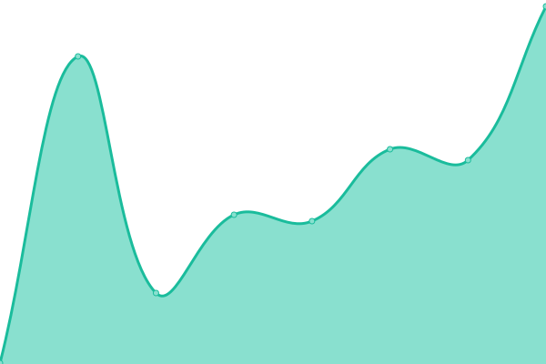
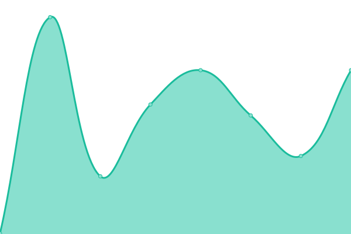

# [📈 Live Status](https://undp.github.io/uptime-monitor): <!--live status--> **🟧 Partial outage**

This repository contains the open-source uptime monitor and status page for [UNDP](https://www.undp.org), powered by [Upptime](https://github.com/upptime/upptime).

With [Upptime](https://upptime.js.org), you can get your own unlimited and free uptime monitor and status page, powered entirely by a GitHub repository. We use [Issues](https://github.com/undp/uptime-monitor/issues) as incident reports, [Actions](https://github.com/undp/uptime-monitor/actions) as uptime monitors, and [Pages](https://undp.github.io/uptime-monitor) for the status page.

<!--start: status pages-->
<!-- This summary is generated by Upptime (https://github.com/upptime/upptime) -->
<!-- Do not edit this manually, your changes will be overwritten -->
<!-- prettier-ignore -->
| URL | Status | History | Response Time | Uptime |
| --- | ------ | ------- | ------------- | ------ |
|  [Main site](https://www.undp.org) | 🟩 Up | [main-site.yml](https://github.com/undp/uptime-monitor/commits/HEAD/history/main-site.yml) | 

 779ms
     
 | 

<a href="https://status.undp.org/history/main-site">100.00%</a>
    

|  [Design system](https://design.undp.org) | 🟩 Up | [design-system.yml](https://github.com/undp/uptime-monitor/commits/HEAD/history/design-system.yml) | 

 381ms
     
 | 

<a href="https://status.undp.org/history/design-system">100.00%</a>
    

|  [Featured stories](https://feature.undp.org) | 🟩 Up | [featured-stories.yml](https://github.com/undp/uptime-monitor/commits/HEAD/history/featured-stories.yml) | 

 443ms
     
 | 

<a href="https://status.undp.org/history/featured-stories">100.00%</a>
    

|  [Human development report](https://hdr.undp.org) | 🟩 Up | [human-development-report.yml](https://github.com/undp/uptime-monitor/commits/HEAD/history/human-development-report.yml) | 

 230ms
     
 | 

<a href="https://status.undp.org/history/human-development-report">100.00%</a>
    

|  [Jobs site](https://jobs.undp.org/cj_view_jobs.cfm) | 🟩 Up | [jobs-site.yml](https://github.com/undp/uptime-monitor/commits/HEAD/history/jobs-site.yml) | 

 1743ms
     
 | 

<a href="https://status.undp.org/history/jobs-site">100.00%</a>
    

|  [Procurement notices](https://procurement-notices.undp.org) | 🟩 Up | [procurement-notices.yml](https://github.com/undp/uptime-monitor/commits/HEAD/history/procurement-notices.yml) | 

 4586ms
     
 | 

<a href="https://status.undp.org/history/procurement-notices">100.00%</a>
    

|  [Stories on exposure.co](https://stories.undp.org) | 🟩 Up | [stories-on-exposure-co.yml](https://github.com/undp/uptime-monitor/commits/HEAD/history/stories-on-exposure-co.yml) | 

 913ms
     
 | 

<a href="https://status.undp.org/history/stories-on-exposure-co">100.00%</a>
    

|  [Transparency portal](https://open.undp.org) | 🟩 Up | [transparency-portal.yml](https://github.com/undp/uptime-monitor/commits/HEAD/history/transparency-portal.yml) | 

 261ms
     
 | 

<a href="https://status.undp.org/history/transparency-portal">100.00%</a>
    

|  [UNDP Giving](https://give.undp.org/) | 🟥 Down | [undp-giving.yml](https://github.com/undp/uptime-monitor/commits/HEAD/history/undp-giving.yml) | 

 1119ms
     
 | 

<a href="https://status.undp.org/history/undp-giving">0.00%</a>
    

<!--end: status pages-->

[**Visit our status website →**](https://undp.github.io/uptime-monitor)

## 📄 License

- Powered by: [Upptime](https://github.com/upptime/upptime)
- Code: [MIT](./LICENSE) © [UNDP](https://www.undp.org)
- Data in the `./history` directory: [Open Database License](https://opendatacommons.org/licenses/odbl/1-0/)
